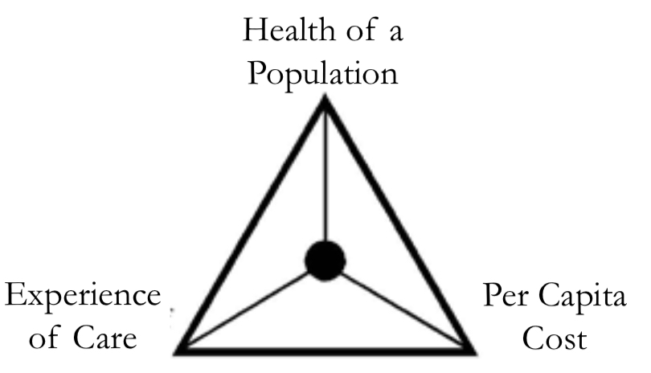
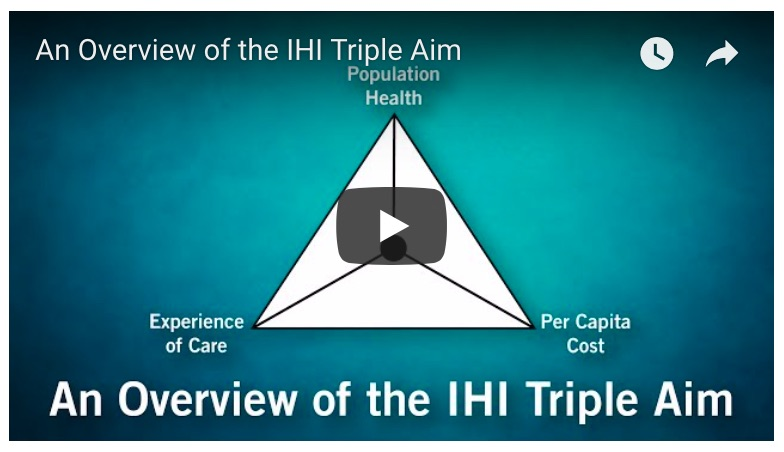

The Triple Aim is a framework that aims to integrate several pillars of healthcare maintenance and delivery in order to promote effective restructuring of healthcare in the United States. This framework was developed in 2008 by the Institute for Healthcare Improvement (IHI), a US-based nonprofit that seeks to cultivate positive change in healthcare systems around the world and improve the health of entire populations.

This framework addresses several major issues of the modern US healthcare system: lack of preventative care, low quality care and poor patient satisfaction, and high costs of care. The Triple Aim is designed to encourage a cooperative integration of interventions that address all three of the the following aspects of healthcare:

Image Source: Stiefel & Nolan, 2012, http://www.ihi.org/resources/Pages/IHIWhitePapers/AGuidetoMeasuringTripleAim.aspx

 
 

So how exactly can the Triple Aim be used in practice? The IHI has developed a set of intervention strategies (Berwick et al. 2008) and outcome measures (Stiefel & Nolan, 2012) that can be used to achieve positive change in the healthcare system, using the Triple Aim as a constant guiding framework.

One of the major prerequisites for the successful implementation of triple aim is the existence of an “integrator” entity that effectively combines the three aspects of the triple for the benefit of a defined population. This integrator entity would help address the goals of the Triple Aim by serving the following purposes:

* **Community Outreach and Integration**
  * Promote transparency of social determinants of health, educate the population, ensure healthcare access for all members of the population, guide individuals through long-term treatment.
* **Primary Care Improvement**
  * Enable an expanded role of primary care providers in the long-term care of patients, promote the “medical home” model of care (see the “Reformed Models of Care” section in Ch. 1, “The US Healthcare System” for details).
* **Population Health Management**
  * Interface with government agencies to promote healthy behaviors, provide resources to the population that promote healthy lifestyles.
* **Financial Management**
  * Design initiatives to reduce waste in healthcare delivery, make healthcare costs transparent to all members of the population and to businesses, promote policies that limit healthcare spending.
* **Macro System Integration**
  * Contract with different organizations to determine the best care possible for the population, educate all system members on current standards of care to ensure quality and cost-effectiveness. 
 
 

In order to continuously monitor the current state of healthcare, the IHI suggests that the following outcome measures be regularly collected and used for targeted (yet still cross-cutting) interventions: 

* **Experience of Care**
  * Patient surveys, based on key dimensions from the Institute of Medicine’s aims for improvement
* **Health of a Population**
  * Health outcomes (mortality, health and functional status, healthy life expectancy)
  * Disease burden
  * Behavioral and physiological factors
* **Per Capita Cost**
  * Total healthcare costs/member of population/month
  * Hospital and ED usage/associated costs

Check out this quick summary video with the IHI’s former president, Donald Berwick, MD:

