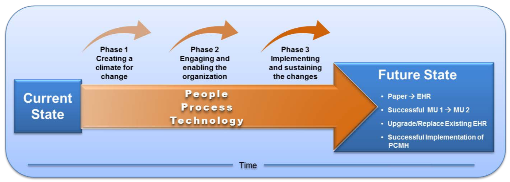

Electronic Health Record systems (EHRs) are information systems that support the delivery of healthcare. They contain patient records in electronic format, such as patient history, observations, prescription information and history, allergy and immunization information, and much more. A key role of EHRs is to provide healthcare professionals with tools to not only retrieve, edit, and store information, but also to manage data and care delivery in a number of new ways that are only possible with computers. To this end, EHR systems are commonly understood to also include tools that facilitate communication and decision making (McDonald, Tang, & Hripcsak, 2014). McDonald et al. define the key functional components of EHR systems as follows:
1. Integrated view of patient data 
2. Clinician order entry 
3. Clinical decision support 
4. Access to knowledge resources 
5. Integrated communication and reporting support 

# What are the key defining points / legislation that drove the mass adoption of EHR systems?
Electronic Health Records, or EHRs, are the cornerstone of almost any healthcare system in use today across the United States and around the world. However, many social, financial, and political factors played important roles in the creation and mass adoption of these systems. In this chapter, we aim to discuss the history behind EHRs, their benefits and challenges, the key EHR actors and what roles they play in the healthcare ecosystem, change management, the blessings and curses of the “Tower of Babel” EHR system, and the history of usability testing of widely used EHR systems.
 
Data management systems in the medical field have been in use as early as the 1960s, with the earliest working electronic medical record being developed in 1972 by the Regenstrief Institute. However, early challenges in computing, data storage, and high costs of development greatly hindered the use of these systems in regular clinical care. It was not until the 1990s, when affordable personal computers and the Internet emerged, that development of EHR systems truly began. One of the key factors in jumpstarting this development was the Institute of Medicine (IOM) publication on the need for computerized medical records (“Computer-Based Patient Record”, 1991). In the publication, the IOM outlined the eight core functions needed to be developed for a successful EHR system. These functions include health information and data, result management, order management, decision support, electronic communication and connectivity, patient support, administrative processes and reporting, and reporting and population health. This report, in conjunction with the Health Information Portability and Accountability Act of 1996, really laid the foundations for the modern electronic health record ecosystem.
 
However, it was not until the dawn of the new century that EHR systems and vendors truly began evolving into the ones we see today. In 1999, the IOM published a ground breaking reported titled “To Err is Human.” This report was widely distributed and began the era of strong governmental involvement and incentivization. Immediately after the report was published, the Clinton Administration issued executive orders for governmental agencies to oversee the reduction of medical errors using proven techniques and for the development of new strategies of reducing errors in the future. A whopping $50 million dollars was budgeted to the Agency for Healthcare Research and Quality (AHRQ) to spearhead these efforts. President George W. Bush added to these efforts by creating the Office of the National Coordinator for Health Information Technology (ONC), almost doubling the budget for healthcare IT projects, and calling for industry-wide adoption of EHR systems by 2014. Although this raised awareness of the flaws of the current medical system and called for the production of electronic solutions, EHR adoption was still in its infancy. This changed in 2009 when President Barack Obama signed into law the Health Information Technology for Economic and Clinical Health (HITECH) Act. The HITECH Act was contained within the American Recovery and Reinvestment Act (ARRA) and led to drastic EHR adoption across the United States. As with the adoption of many ideas throughout time, the primary reason for the sudden widespread use of EHR systems was the availability of large amounts of funding, almost $19.2 billion reserved for hospitals and physicians. Although initially designed to be a “carrot-and-stick” system to enforce adoption, the large amounts of funding coupled with the low bar set for EHR certification allowed for drastic improvements in adoption, one statistic states annual adoption for eligible hospitals went from 3.2% to 14.2% (a 4x change)! Only recently have we begun to see the “stick” portion of the program being used to enforce the program. Under the HITECH Act’s “Meaningful Use” portion, various stages have been defined in order to ensure the quality of healthcare increases post adoption of these electronic systems. Hospitals and physicians not able to meet these criteria have already begun to receive penalties and have their funding revoked until they are able to show outcome improvement through EHR certification and the submission of clinical quality measures selected by the Secretary of Health and Human Services.
 
While the landscape of EHR systems is still changing and reacting to new discoveries being made daily, we can see how social and governmental factors have helped define and will continue to define the system in place today. It will certainly be interesting to follow this journey in the coming years as technology advances and people become more and more involved with their healthcare management.

Additionally, it is important to acknowledge the work some "home-grown" EHR systems have done on the adoption of the vendor systems we see today. Notably, RMRS ([Regenstrief Medical Record System](https://www.sciencedirect.com/science/article/pii/S138650569900009X)), discussed a little in the second chapter above, and WebCIS ([Web-based clinical informatics system](https://www.ncbi.nlm.nih.gov/pubmed/10566471)). Innovations are built on strong foundations of knowledge. These systems along with countless other smaller systems paved the way for more modern EHR systems like Epic and Cerner.  
 
Check out this infographic detailing some of the points discussed above about EHR adoption:

Image Source: VertitechIT, https://www.vertitechit.com/history-healthcare-technology/

# What are advantages and disadvantages of EHR Systems?
Many of the advantages and disadvantages of EHR systems are common to all information technology systems. To mention just a few:

Typed text does not suffer from the same readability issues that handwriting may be subject to, it is much easier to edit and reorganize, and it can be printed if a hard copy is desired. Electronic text is also searchable. On the other hand, typing on a computer keyboard is a skill that must first be learned (McDonald, Tang, & Hripcsak, 2014; Gawande, 2019).
Data are stored in a central database, which allows any number of users on a variety of devices to access the data and see changes reflected in all users’ views immediately. This is especially useful for medical records, as patients may be seen by a number of healthcare professionals across a variety of settings and locations, and having a single physical medical record would substantially limit the ability to access the patient record at every time and place where it is needed (McDonald, Tang, & Hripcsak, 2014). On the other hand, having the data in a single database which is accessible by many different people makes it more likely that information may be accessed in ways that are inappropriate, unethical, or out of line with business objectives. Additionally, if this single database becomes unavailable for some reason, healthcare can not be provided in an efficient and effective manner, or even not at all (McDonald, Tang, & Hripcsak, 2014).
Digital records can be searched, indexed, categorized, and aggregated for analysis. The task of finding the records of all patients with Diabetes is very nearly insurmountable if the records are on paper; however, the task becomes much easier with electronic records, and trivial if the data are stored discretely and with standardized coding (e.g. ICD codes) (McDonald, Tang, & Hripcsak, 2014). On the other hand, enabling such capabilities requires additional steps that can be expensive to the healthcare organization and time consuming to the healthcare provider, and the cost-benefit tradeoff may not seem favorable from the care provider’s point of view (e.g. diagnoses have to be entered in the form of ICD codes by the diagnosis physicians).

The digitization of electronic health records is the first step in enabling a number of innovations in healthcare; however, a substantial investment of time and money is required on an ongoing basis from various stakeholders (McDonald, Tang, & Hripcsak, 2014). Which parts of the information system benefit certain stakeholders and which ones are burdens to them often varies in complex ways, and thus causes a considerable amount of tension within hospitals and clinics today.

In addition to the benefits and challenges that are common to all information systems, electronic health record systems have unique disadvantages as well. In the development and deployment of software systems, it is impossible to get it right the first time - there will always be imperfections in the software, such as major and minor software bugs, bad configuration, and confusing user interfaces (Gawande 2019). What’s special about the healthcare setting is that one problem with the EHR could be the difference between life and death for a patient. While other systems can iteratively grow and improve, there isn’t much wiggle room for systems supporting critical healthcare workflows. 

On the other hand, the idea of integrating computers into healthcare delivery and management processes also comes with tremendous opportunities. By eliminating the inefficiencies of paper records, automation can save an immense amount of time in the long run, and help care providers focus on theirs patients instead. By automating large parts of workflows, opportunities for human error are removed. Patients can view and manage their health information online, contributing to patient satisfaction. Clinical decision support tools enabled by the digitization of health information can make practicing evidence-based medicine much easier with the evidence right at the care providers’ fingertips. In addition, analytics and predictive modeling open up a whole new world of potential benefits. Scheduling inefficiencies and wasteful practices can be discovered and fixed. Root causes of bad outcomes can be determined and addressed. Patient outcomes can be improved through clinical decision support by way of predictive models, such as early warning systems and patient classification models. These and many other ways to improve health care would not be possible without electronic health record systems. Many of these opportunities are yet to be developed and broadly operationalized, and the biomedical and health informatics students of today will be integral in making them happen.

# How do different stakeholders contribute to the operation and configuration of EHRs, and what challenges do they each face?

Recent publications have pointed fingers at EHR vendors as the primary actors responsible for major pitfalls in EHR usability and clinical effectiveness, and it is no secret that healthcare providers have very troubled relationships with their computers in the workplace (Schulte & Fry, 2019; Gawande, 2019). However, vendors are only one part of a large and complex network of key stakeholders in the healthcare ecosystem that is collectively responsible for safely and effectively incorporating EHRs into the healthcare delivery process. While EHR vendors develop the software itself, several important processes--including system selection by healthcare providers, customization and implementation--must occur before the software is truly functional. Each of these processes involves different stakeholders with varying (and often competing) interests, and the overall pipeline for EHR adoption should thus be considered when identifying possible solutions for preventing adverse effects of EHR use.

EHR vendors are at the forefront of the EHR development and implementation process, and they therefore receive the brunt of the criticism for poor system design and adverse clinical outcomes. Aside from obvious glitches in technical functionality, however, the major failures of EHR systems arise from much more complex interactions between machines and the highly diverse pool of healthcare workers who interact with them. While it is clear that EHR development is in sore need of an established user-centered design protocol [see “What is the history of usability analyses with respect to the EHR and their vendors?” below], vendors are also pressured to design complex, information-rich systems that suit an enormous variety of healthcare provider workflows. These demands for basic operability often taken precedence over usability testing, which requires significant time and financial investments and must also address the needs of a wide variety of users. Current users are also resistant to sharing adverse clinical events associated with EHR usability issues, due to a lack of legal protections for providers who share this type of information (Ratwani et al. 2015).

Those in charge of healthcare organizations--whether they are privately practicing physicians or management/IT personnel at a larger healthcare institution--are also tasked with choosing the right EHR for their practice. There were almost 700 certified EHR vendors in the health IT market as of 2016 (ONC-HIT, 2017), and these systems have varying functionalities, user interfaces, costs and implementation support staff. While certain EHR systems may be better suited for practices of specific sizes and with unique IT needs, the process of choosing the right system can take anywhere from several months to several years, and many smaller practices may not have the resources to conduct a thorough search (Adler, 2005). Many of the more well-developed EHRs are also prohibitively expensive for smaller practices, and they must therefore choose cheaper systems that are more error-prone and have fewer capabilities. Some providers even resort to creating their own EHR softwares in-house to suit their own financial and workflow needs.

Once an EHR system is chosen, healthcare providers and/or management are also responsible for customizing the system and choosing which features they would like to incorporate to meet their specific needs. The specific EHR features incorporated into the functional EHR system during the implementation process do not undergo the same certification testing that the base software does, and these unmonitored and untested changes have been known to contribute to patient harm (The Pew Charitable Trusts et al. 2018). Implementation of EHRs is further complicated by physicians’ resistance to adopting novel patient care workflows and difficulties accommodating the needs and opinions of a wide variety of healthcare personnel within a healthcare organization (Boonstra et al. 2014). 

Overall, competing interests of stakeholders in the EHR creation, acquisition and implementation process contribute significantly to major issues with current EHR systems in practice.

# What is change management and why is it important for EHR implementation?

The Change Management Learning Center defines change management as a multi-step change model centered on the belief that any change has an emotional and situational component where a set of tools, processes, skills, and principles are used to achieve the required outcomes of a change project or initiative. In healthcare, change management is used for evolving into a model that uses technology for safety, quality, and efficient patient care services that comply with regulatory specifications and requirements. Change management depends on three main major changes that need to happen in the organization:

1. Changing how people work: The way people work together can alter organizational culture because changes create uncertainty, are fears of loss and team pressure can be powerful for resisting change. Involving staff at all levels of the change process will help overcome these issue by making people feel validated and eager to participate in giving practical solutions to potential problems.
2. Changing processes: Staff is the one that should propose and implement the changes because they are the experts on what is not currently working. All of those changes should be pilot tested for making the necessary adjustments.
3. Changing technology: Making changes in technology platforms will result in changes in policy, procedures, and processes. It is important to explain to staff how the technology change will impact them in their daily duties, and to emphasize potential improvements that will affect them directly.

Change management is composed of three phases: (1) Creating a Climate for Change; (2) Engaging and Enabling the Organization, and (3) Implementing and Sustaining the Change. For all phases, is important to recognize that the whole change process will significantly improve if everyone in the organization understands the necessity for the change, what the current and future states of the organization are, and how technology will help the organization reach the future state. This process should not only be done with the staff but also with the patients that are going to be affected by the changes to ensure that the changes will benefit the patients as well.
 

  
_Phase 1: Creating a Climate for Change_

In this phase, the administration will need to acknowledge the current state of the organization envision the ideal future state. By defining the future state and establishing a clear vision of it, providers and patients will know exactly what is going to happen, how is it going to happen and how it will affect their ability to provide and receive emotional support for future stages. In order for this to happen, it is important to open a communication channel with all the personnel and patients of the organization. This phase is crucial because most patients and providers are comfortable with what they already know and are frightened by the unknown of the future state, regardless of whether the current state of the organization is ineffective and sloppy.

It all will start with the administration creating a sense of urgency for evolving from the current state to the future state, which involves recognizing the current state’ points of improvement and the strengths that the future state can give to the organization. After that, the administration will need to identify the key staff (called the ‘guiding team’) that will help lead the initiative. The guiding team is usually formed by people who understand the goals and vision for the future state, are ‘people oriented’, and are familiar with the organization processes and workflows.
 
_Phase 2: Engaging and Enabling the Organization_

In this phase, the administration and the guiding team will develop strategies that will engage everyone in the organization in the change process. The organization will need to think of innovative communication techniques for interactively communicating and demonstrating to the staff how the future state will, and for making them an integral part of the process and gathering their inquiries, suggestions, and comments. Enabling staff participation in the design, implementation, and evaluation of the change process will help them feel recognized and empowered to find practical solutions. It is important to recognize that staff involvement in this process is critical to achieving a successful change implementation. 
 
_Phase 3: Implementing and Sustaining the Change_

The focus in this phase is to monitor the guiding team and ensure that the change endures. Training and retraining, providing technical assistance to the staff, and letting them know how to address problems are key to achieving organizational goals. 

# What are the benefits of a "Tower of Babel" EHR System?

Interoperability of an EHR system can be defined as the ability of individuals and care providers to easily obtain health information in an electronic format, facilitating convenient, accurate and well-coordinated medical decisions. This will help transform healthcare into a model that addresses health beyond the confines of the health care system and will lead to empowering the patients themselves. This will be possible with a flexible health information technology ecosystem that is able to support transparency and decision-making while reducing redundancy. Achieving this will allow patients to become active participants in their health care, and it can improve the overall health of the population.
 
As health IT has expanded EHR adoption and use, the need for sharing health information easily and appropriately has become necessary. A health IT ecosystem that is interoperable makes data available to the right people at the right time across products and organizations in a way that the recipients can use the data in a meaningful way. This type of ecosystem will help lower health care costs, improve population health, empower consumers, and drive innovation through supporting critical public health functions like real-time disease surveillance, disaster response and data aggregation for research. Achieving this will translate into higher quality care instead of a higher quantity of care.
 
Accomplishing an interoperable health IT ecosystem will be achieved by follow guiding principles like:
- Building upon the existing health IT infrastructure
- Allowing room for fulfilling all the specific needs every provider may have
- Empowering individuals
- Simplifying implemented solutions
- Striving for modular systems
- Supporting multiple levels of advancement
- Focusing on value
- Protecting privacy and security
 
To accomplish this, a plan needs to be followed that (1) improves the interoperability of existing health information networks and escalation, (2) ensures that health care improves and that the costs become lower, and (3) considers continuous learning and improvement with the analysis of aggregated data from different sources.

# What is the history of usability analyses with respect to the EHR and their vendors?
Very briefly, it is important to mention the state of usability testing and human-centered design approaches being used in current EHR systems. Compared to other types of research being done -- such as addition of clinical decision support to EHRs, creation of interoperability standards, predictive analytics, and integration of mobile technologies -- actual EHR system usability analyses are still in their infancy. A PubMed search for the terms “usability” AND “EHR” only resulted in an average of 35 publications every year, compared to the average 400 publications for “clinical decision support” and an average of 800 publications for “medical errors.” In 2015, Ratwani et al. conducted usability analyses of eleven EHR vendors in order to better understand the user-centered design principles being employed by these vendors and the overall usability of their systems. They found that, despite certification requirements from the Office of the National Coordinator (ONC) mandating the employment of user-centered design approached, many EHR vendors on the market today fail to have well-designed usability protocols and often have misconceptions due to lack of usability experience. The most common pitfalls reported include testing after deployment, failing to understand the utility of testing, failing to carefully study complex clinical workflows, lack of approval from leadership personnel, and low recruitment of participants for usability studies. 
Without proper usability testing, systems will continue to fail to live up to their initial expectations and result in more medical errors. It is up to future developers and researchers to employ user-centered design principles throughout the development and implementation of EHR systems and to lobby behind the movement advocating for better usability.

Check out this infographic created by the Wellsoft group detailing the problems of poor usability and the benefits that could arise with proper testing:

# References

Ratwani, R., Fairbanks, R., Hettinger, A., & Benda, N. (2015). Electronic health record usability: Analysis of the user-centered design processes of eleven electronic health record vendors. Journal of the American Medical Informatics Association, 22(6), 1179-1182.

EHR Usability: What is it, why is it so important, and how can it be measured? - Wellsoft. https://wellsoft.com/ehr-usability/. Accessed May 2, 2019.
A 10-Year Vision to Achieve an Interoperable Health IT Infrastructure. (n.d.). Retrieved May 2, 2019, from https://www.healthit.gov/sites/default/files/ONC10yearInteroperabilityConceptPaper.pdf
3rd Edition. Upper Saddle River, N.J. : Pearson Prentice Hall; 2017.
 
The History of Healthcare Technology and the Evolution of EHR. https://www.vertitechit.com/history-healthcare-technology/. Accessed May 2, 2019.

Meaningful Use 2015: The History of Meaningful Use. https://technologyadvice.com/blog/healthcare/history-of-meaningful-use-2015/. Accessed May 2, 2019.

What are the three stages of meaningful use? NueMD Industry News. https://www.nuemd.com/news/2013/04/10/what-are-the-three-stages-of-meaningful-use. Accessed May 2, 2019.

EMR: The Progress to 100% Electronic Medical Records. https://elearning.scranton.edu/resource/health-human-services/emr_the-progress-to-100-percent-electronic-medical-records. Accessed May 2, 2019.

Adler, Kenneth G. (2005). How to select an electronic health record system: These 12 steps will help make the selection process easier and lead you to the HER that's right for your practice. Family Practice Management, 12(2), 55-62.

Boonstra, A., Versluis, A., & Vos, J. (2014). Implementing electronic health records in hospitals: A systematic literature review. Bmc Health Services Research, 14(1), 370.

Gawande, A. (2019). Why Doctors Hate Their Computers. The New Yorker, The New Yorker, 24 Apr. www.newyorker.com/magazine/2018/11/12/why-doctors-hate-their-computers.

Office of the National Coordinator for Health Information Technology (ONC-HIT). Certified Health IT Developers and Editions Reported by Health Care Professionals Participating in the Medicare EHR Incentive Program, Health IT Quick-Stat #30. dashboard.healthit.gov/quickstats/pages/FIG-Vendors-of-EHRs-to-Participating-Professionals.php. July 2017.

Schulte, F & Fry, E. Death By 1,000 Clicks: Where Electronic Health Records Went Wrong. Kaiser Health News, 25 Apr. 2019, khn.org/news/death-by-a-thousand-clicks/.

The Pew Charitable Trusts, American Medical Association, & Medstar Health. Ways to Improve Electronic Health Record Safety: Rigorous testing and establishment of voluntary criteria can protect patients. Retrieved from http://www.pewtrusts.org/-/media/assets/2018/08/healthit_safe_use_of_ehrs_report.pdf.

The Office of the National Coordinator for Health Information Technology. Connecting Health and Care for the Nation: A Ten Year Vision to Achieve Interoperable Health IT Infrastructure 1 Overview [Internet]. [cited 2019 May 2]. Available from: http://healthit.gov/policy-researchers-implementers/state-hie-implementation-status

U.S. Department of Health & Human Services, Human services of the National Coordinator for Health Information Technology. Change Management in EHR Implementation Primer. Version 1.0 [Internet]. 2013 [cited 2019 May 2]. Available from: https://www.healthit.gov/sites/default/files/resources/changemanagementprimer_feb2014.pdf

McDonald, C., Tang, P., & Hripcsak, G. (2014). Electronic Health Record Systems. In: Shortliffe, E. & Cimino, J. Biomedical Informatics: Computer Applications in Health Care and Biomedicine (4th ed. 2014 ed.). London: Springer London.
