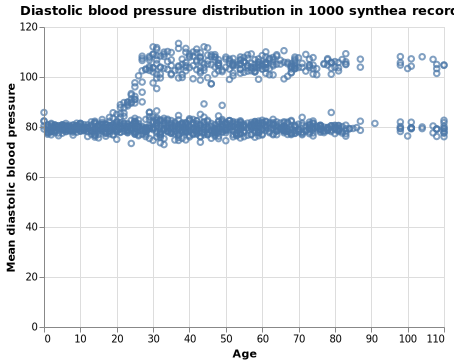

# How de we define privacy and confidentiality in the context of health data?

The words “privacy” and “confidentiality” often are used interchangeably in most everyday contexts. If a system claims to have taken appropriate “privacy” precautions, most users would also assume that their data’s “confidentiality” is intact. However, in the practice of healthcare, “privacy” and “confidentiality” have clear distinctions. According to [Tom Payne](https://www.uwmedicine.org/bios/thomas-payne), former chair of AMIA’s Board of Directors and the current UW Medicine's Medical Director of Information Technology Services, “privacy” is an individual’s desire to limit the disclosure of personal information whereas “confidentiality” is a condition in which information is shared or released in a controlled manner. In order for a system to have data confidentiality, the user’s privacy must first be understood and documented and then appropriate measures can be taken in order for that desire to be fulfilled. 

Under the Health Information Portability and Accountability Act (HIPAA), there exists guidelines and regulations that must be upheld by health institutions for the safeguarding of medical information and to protect the rights of patients. Two specific guidelines include the HIPAA Privacy Rule and the HIPAA Security Rule. The HIPAA Privacy Rule establishes national standards to protect patient’s medical records by establishing rules on proper de-identification of information, sets limits and conditions on the uses and disclosures of information (with and without patient authorization), and also gives patients rights over their healthcare information (such as the right to examine and copy their health records and to request corrections if necessary). The HIPAA Security Rule establishes standards to protect electronic health information that is created, sent, received, or used by a healthcare entity. The Security Rule requires appropriate security training of individuals, physical and administrative safeguards, appropriate technical documentation, and use of data contracts in order to ensure proper confidentiality and integrity of protected healthcare information. Connecting this back to the beginning of this section, the HIPAA Privacy Rule protects and upholds an individual’s “privacy” while the HIPAA Security Rule works to maintain a state of proper “confidentiality.” Both pieces of legislation work together in order to protect the sensitive health data across all states and in all disciplines of healthcare. 

# What are some of the current and upcoming methods for implementing health data security standards?

Although the HIPAA security rule sets standards for when, how and by whom electronic health information can be accessed, it does not provide standards for exactly what types of technologies should be used in order for organizations to be HIPAA compliant. Many organizations therefore adopt **security frameworks** that help them develop their own institution-specific structures for safeguarding sensitive data. The Healthcare Information and Management Systems Society (HIMSS) recommends that the healthcare sector adopt a universal security framework for protecting health data, and specifically recommends the National Institute of Standards and Technology (NIST) framework which has been evolving for over 20 years (HIMSS Cybersecurity Position Statement, 2016). The NIST framework provides a set of actionable, adaptable guidelines that help organizations perform the following tasks (Barrett, 2018):

>1. Describe their current cybersecurity posture;
>2. Describe their target state for cybersecurity;
>3. Identify and prioritize opportunities for improvement within the context of a continuous and repeatable process;
>4. Assess progress toward the target state;
>5. Communicate among internal and external stakeholders about cybersecurity risk.

However, the NIST framework has not yet been universally adopted by healthcare organizations. A survey carried out by HIMSS between December 2017 and January 2018 revealed that 57.9% of the 239 participating organizations used the NIST security framework, while the second and third most widely used frameworks were HITRUST (26.4%) and Critical Security Controls (24.7%). 16.9% of participating organizations reported that no security framework had been used, and 8.4% were not sure whether a security framework had been implemented (HIMSS Cybersecurity Survey, 2018). HIMSS views the universal adoption of a well-established security framework as a necessary step for ensuring the security of health data, because many security breaches are caused by inconsistent or ill-advised data security practices within an organization.

While security frameworks help establish the best organizational practices for a comprehensive security program, technical security standards are used to establish the best practices for setup and monitoring of an organization’s Information Security Management System (ISMS). The NIST security framework commonly references the International Organization for Standardization/International Electrotechnical Commission (ISO/IEC) 27001 standards for security management practices. However, the HIMSS 2018 Cybersecurity Survey reported that only 18.5% of participating organizations had used the ISO technical security standard in their information security framework implementations.

# What are some major breaches in healthcare security that have occurred, and what lessons have we learned from them?

# Do we really need to share healthcare data? What technologies could we use to circumvent the need to share data?

Sharing healthcare data is often a necessity, for example when it is needed for the purposes of care continuity. However, for many secondary uses of healthcare data, such as machine learning and other statistical analyses, as well as for testing clinical applications, it may not be necessary to share the data. 

Recently, several research groups have taken an interest in generating synthetic health record data. Synthetic data in this context refers to dummy EHR data which retains some of the properties that are needed for it to be used for certain purposes, but does not actually refer to real patients or real events. An example of a very simple approach for generating fake EHR data is Synthea, published by SyntheticHealth and [accessible on Github](https://github.com/synthetichealth/synthea) (synthetichealth, n.d.). Data, including patient demographics, observations, and history, can be generated using Synthea and are commonly used to populate test EHR systems, e.g. the [clinfhir.com](http://clinfhir.com/) FHIR sandbox server.
However, simple approaches such as this one are not suitable for more advanced purposes such as statistical analysis; generally, distributions of patient data are not well preserved in Synthea data; for example, most patients’ blood pressure values will fall into one of two broad categories (roughly corresponding to “high” and “normal”), and associations of blood pressure with age or gender are not preserved.

Choi et al. (2017) reported another approach, called medGAN, which is intended to preserve these distributions. In theory, EHR data generated this way can not only be used for basic statistical analysis, but for more advanced analysis such as machine learning as well. For machine learning, the data has to be truly realistic in many ways, which is challenging. MedGAN is a generative adversarial network, which employs two neural networks: one that generates synthetic data sets, and one that classifies datasets as real or fake. As the first model generates more and more datasets that either fail or pass the other network’s scrutiny, it learns from its mistakes; meanwhile, the second model gets better at recognizing fake datasets. As the two neural networks play against each other in this adversarial game, they both continue to get better at their respective tasks, culminating in the first generator getting so good that the synthetic EHR data set is indistinguishable from a real dataset, even though it refers to people and events that are completely made up. The resulting datasets can then be shared freely and used for the same purposes that real data would be used for, such as training predictive models for recognition of sepsis, identification of patients at high risk for readmission, and many other purposes.

Apart from synthetic data, there are other approaches to avoiding the need to share data altogether. In a recent review, Kuo et al. (Kuo, Kim, & Ohno-Machado, 2017) discuss uses of Blockchain technology in healthcare, including to train predictive models in a distributed fashion. Kuo et al. developed an approach called ModelChain (Kuo et al. 2018) for this purpose. In this approach, healthcare organizations join a permissioned blockchain network with the purpose of jointly training a predictive model. Models trained on data from multiple different organizations are more generalizable due to the diversity of the ingested data. The distributed ledger in this particular case of a blockchain consists of the partially trained model; in other words, the model is shared and kept in sync across all participants, but no patient data is shared. Each member of the blockchain has the opportunity to create the next block in the chain if the testing error of the model for the particular member’s EHR database is higher than that of any other member. Thus, the member organizations continue switching off, training the model on their data in turn, but sharing with each other only the model parameters, until the model performance converges and the error no longer improves. Through this process, all members of the blockchain network benefit from the diversified model without having to compromise exclusive control over their patients’ data. 

These examples demonstrate some of the work that is currently ongoing in the realm of privacy preservation. Informaticists will continue play a crucial role in preserving data security, confidentiality, and privacy in the future, and will continue to be a source of paramount expertise in how to safely deidentify and share patient data. However, while having access to real patient data for statistical analysis and advanced data science remains, and will likely always be, the gold standard, it is important to recognize that biomedical and health informatics also have an opportunity to mitigate the need to share data in the first place.

# References

Barrett, M.P. (2018). Framework for Improving Critical Infrastructure Cybersecurity Version 1.1. NIST. https://doi.org/10.6028/NIST.CSWP.04162018 

HIMSS Cybersecurity Position Statement (2016). HIMSS North America. Retrieved from https://www.himss.org/sites/himssorg/files/Tab%2001%20Cybersecurity%20Position%20Statement%20UPDATED.pdf

HIMSS Cybersecurity Survey (2018). HIMSS North America. Retrieved from https://www.himss.org/sites/himssorg/files/u132196/2018_HIMSS_Cybersecurity_Survey_Final_Report.pdf

Choi, E., Biswal, S., Malin, B., Duke, J., Stewart, W., & Sun, J. (2017). Generating Multi-label Discrete Patient Records using Generative Adversarial Networks.

Kuo, T.-T., Kim, H.-E., & Ohno-Machado, L. (2017). Blockchain distributed ledger technologies for biomedical and health care applications. Journal of the American Medical Informatics Association: JAMIA, 24(6), 1211–1220.

synthetichealth. (n.d.). synthetichealth/synthea. Retrieved June 9, 2019, from GitHub website: https://github.com/synthetichealth/synthea

Kuo, T., & Ohno-Machado, L. (2018). ModelChain: Decentralized Privacy-Preserving Healthcare Predictive Modeling Framework on Private Blockchain Networks.

Adapted from Patel, Harsh. (2018) Introduction to Biomedical and Health Informatics. BIME 530.

HIPAA for Professionals (2017). U.S. Department of Health and Human Services. Retrieved from https://www.hhs.gov/hipaa/for-professionals/security/index.html
